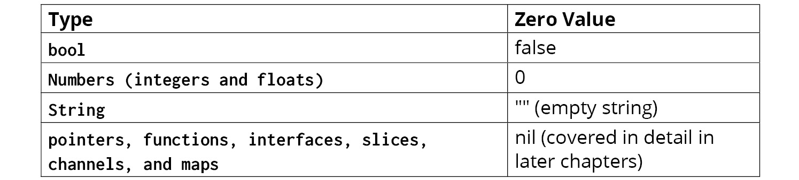

- Go has a statically typed and type-safe memory model with a garbage collector.
- Go is designed to take advantage of multiple CPU cores.

---
- list all standard libraries: `go list std`
```bash
$ go list std
$ go list std | less -N // To scroll
$ go list std | grep -i str // To search a pkg

$ go list std | grep -i math
math
math/big
math/bits
math/cmplx
math/rand
runtime/internal/math

```

- list all subpackages: `go list <package_name>/...`
```bash
$ go list math/...
math
math/big
math/bits
math/cmplx
math/rand
```

- Doc of a package: `go doc <package_name>`
```bash
$ go doc math

$ go doc math/rand
```
- Doc of a specific Type or function: `go doc <package_name>.<Type|function name>` 
```bash
$ go doc math/rand.Intn
package rand // import "math/rand"

func Intn(n int) int
    Intn returns, as an int, a non-negative pseudo-random number in [0,n) from
    the default Source. It panics if n <= 0.
doc 
```

```bash
$ go doc time.Time
package time // import "time"

type Time struct {
        // Has unexported fields.
}
...
```

---

- Zero values
  - 