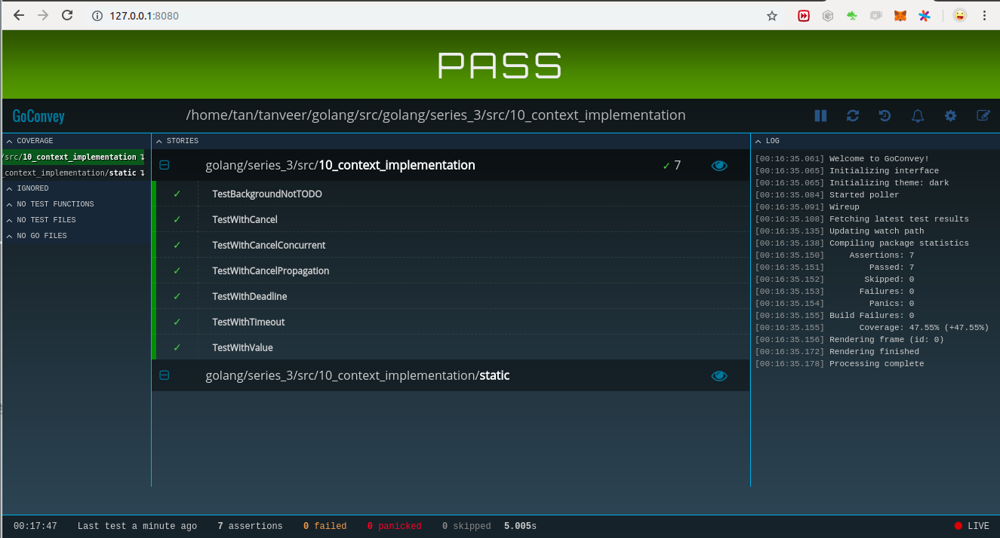

[ref](https://github.com/campoy/justforfunc/tree/master/10-contextimpl)

Always test for race condition:
```bash
10_context_implementation$ go test -race
==================
WARNING: DATA RACE
Write at 0x00c00008c2e8 by goroutine 11:
  golang/series_3/src/10_context_implementation.WithCancel.func1()
      /home/tan/tanveer/golang/src/golang/series_3/src/10_context_implementation/context.go:57 +0x7b

Previous read at 0x00c00008c2e8 by goroutine 10:
  golang/series_3/src/10_context_implementation.(*cancelCtx).Err()
      /home/tan/tanveer/golang/src/golang/series_3/src/10_context_implementation/context.go:42 +0x3e
  golang/series_3/src/10_context_implementation.TestWithCancelConcurrent()
      /home/tan/tanveer/golang/src/golang/series_3/src/10_context_implementation/context_test.go:40 +0x99
  testing.tRunner()
      /usr/local/go/src/testing/testing.go:909 +0x199

Goroutine 11 (running) created at:
  time.goFunc()
      /usr/local/go/src/time/sleep.go:168 +0x51

Goroutine 10 (running) created at:
  testing.(*T).Run()
      /usr/local/go/src/testing/testing.go:960 +0x651
  testing.runTests.func1()
      /usr/local/go/src/testing/testing.go:1202 +0xa6
  testing.tRunner()
      /usr/local/go/src/testing/testing.go:909 +0x199
  testing.runTests()
      /usr/local/go/src/testing/testing.go:1200 +0x521
  testing.(*M).Run()
      /usr/local/go/src/testing/testing.go:1117 +0x2ff
  main.main()
      _testmain.go:48 +0x223
==================
--- FAIL: TestWithCancelConcurrent (1.00s)
    testing.go:853: race detected during execution of test
FAIL
exit status 1
FAIL	golang/series_3/src/10_context_implementation	1.009s

```

To overcome race error we have used `sync.Mutex` 
```go
func (ctx *cancelCtx) Err() error {
	ctx.mu.Lock()
	defer ctx.mu.Unlock()
	return ctx.err
}
```
and 
```go
	cancel := func() {
		ctx.mu.Lock()
		defer ctx.mu.Unlock()
		ctx.err = Canceled
		close(ctx.done)
	}
```

---
Go testing in the browser. Integrates with `go test`. Write behavioral tests in Go [goconvey](https://github.com/smartystreets/goconvey)
```bash

10_context_implementation$ go get github.com/smartystreets/goconvey
10_context_implementation$ goconvey
```