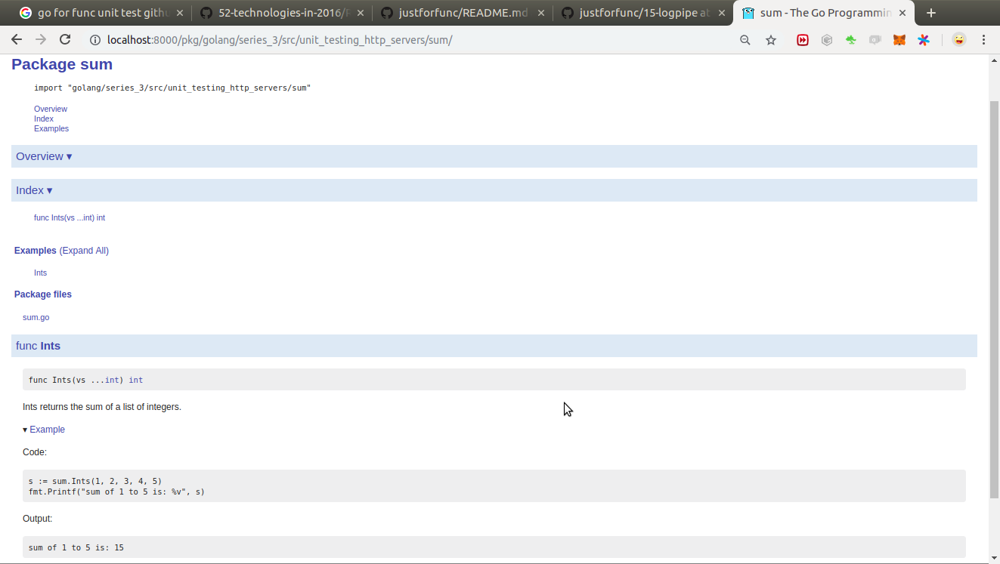

With no tests:
```bash
sum$ go test
?       golang/series_3/src/unit_testing_http_servers/sum       [no test files]
```

Run tests with verbose mode:
```bash
sum$ go test -v
=== RUN   TestInts
--- PASS: TestInts (0.00s)
PASS
ok  	golang/series_3/src/unit_testing_http_servers/sum	0.002s

```

- **`Errorf`** vs **`Fatalf`**
  - *Errorf* - Logs the error and continues the execution.
  - *Fatalf* - logs the error and stops the execution.
  
  ```go
  func TestInts(t *testing.T) {
  	t.Errorf("Failed but will allow further execution")
  	t.Fatalf("Will stop it here.")
  	t.Errorf("I will not execute")
  }
  ``` 
  
  ```bash
  sum$ go test -v
  === RUN   TestInts
  --- FAIL: TestInts (0.00s)
      sum_test.go:7: Failed but will allow further execution
      sum_test.go:8: Will stop it here.
  FAIL
  exit status 1
  FAIL	golang/series_3/src/unit_testing_http_servers/sum	0.002s

  ```
  
Test with coverage (of pkg):
```bash
sum$ go test -cover
PASS
coverage: 100.0% of statements
ok  	golang/series_3/src/unit_testing_http_servers/sum	0.002s

```

Get coverage stats:
```bash
sum$ go test -coverprofile=coverage.out
PASS
coverage: 100.0% of statements
ok  	golang/series_3/src/unit_testing_http_servers/sum	0.002s

sum$ cat coverage.out 
mode: set
golang/series_3/src/unit_testing_http_servers/sum/sum.go:4.26,6.2 1 1
golang/series_3/src/unit_testing_http_servers/sum/sum.go:9.25,10.18 1 1
golang/series_3/src/unit_testing_http_servers/sum/sum.go:14.2,14.29 1 1
golang/series_3/src/unit_testing_http_servers/sum/sum.go:10.18,12.3 1 1
```

HTML coverage report:
```bash
sum$ go tool cover -html=coverage.out
```

Function coverage:
```bash
sum$ go tool cover -func=coverage.out
golang/series_3/src/unit_testing_http_servers/sum/sum.go:4:	Ints		100.0%
golang/series_3/src/unit_testing_http_servers/sum/sum.go:9:	ints		100.0%
total:								(statements)	100.0%
``` 

---

**Sub tests**:

- Here `t.Run` creates a sub test for all the tt(test table) cases, which could be triggered individually. 
```go
	for _, tc := range tt {
		t.Run(tc.name, func(t *testing.T){
			s := Ints(tc.numbers...)
			if s != tc.sum {
				t.Fatalf("sum of %v should be %v; got %v", tc.name, tc.sum, s)
			}
		})
	}
```

```bash
sum$ go test -v
=== RUN   TestInts
=== RUN   TestInts/one_to_five
=== RUN   TestInts/no_numbers
=== RUN   TestInts/one_and_minus_one
--- PASS: TestInts (0.00s)
    --- PASS: TestInts/one_to_five (0.00s)
    --- PASS: TestInts/no_numbers (0.00s)
    --- PASS: TestInts/one_and_minus_one (0.00s)
PASS
ok  	golang/series_3/src/unit_testing_http_servers/sum	0.002s
```

- Running all sub tests whose name starts with `one`
```bash
sum$ go test -v -run Ints/one
=== RUN   TestInts
=== RUN   TestInts/one_to_five
=== RUN   TestInts/one_and_minus_one
--- PASS: TestInts (0.00s)
    --- PASS: TestInts/one_to_five (0.00s)
    --- PASS: TestInts/one_and_minus_one (0.00s)
PASS
ok  	golang/series_3/src/unit_testing_http_servers/sum	0.002s
```

- Running sub test by exact name:
```bash
sum$ go test -v -run Ints/no_numbers
=== RUN   TestInts
=== RUN   TestInts/no_numbers
--- PASS: TestInts (0.00s)
    --- PASS: TestInts/no_numbers (0.00s)
PASS
ok  	golang/series_3/src/unit_testing_http_servers/sum	0.002s

```

-----
**Examples as Tests**

Could be added in file `examples_test.go`:
- So running `go test` will run tests from examples_test also:
```bash
sum$ go test -v
=== RUN   TestInts
=== RUN   TestInts/one_to_five
=== RUN   TestInts/no_numbers
=== RUN   TestInts/one_and_minus_one
--- PASS: TestInts (0.00s)
    --- PASS: TestInts/one_to_five (0.00s)
    --- PASS: TestInts/no_numbers (0.00s)
    --- PASS: TestInts/one_and_minus_one (0.00s)
=== RUN   ExampleInts
--- PASS: ExampleInts (0.00s)
PASS
ok  	golang/series_3/src/unit_testing_http_servers/sum	0.002s
```


In `example_test.go` :
```go
func ExampleInts() {
	s := sum.Ints(1, 2, 3, 4, 5)
	fmt.Printf("sum of 1 to 5 is: %v", s)
	// Output:
	// sum of 1 to 5 is: 15
}
```

The output below commented `// Output:` section is what gets tested.

- The examples can also be seen in the `godoc` documentation:
```bash
sum$ godoc -http=localhost:8000
using module mode; GOMOD=/home/tan/tanveer/golang/src/golang/go.mod

``` 

