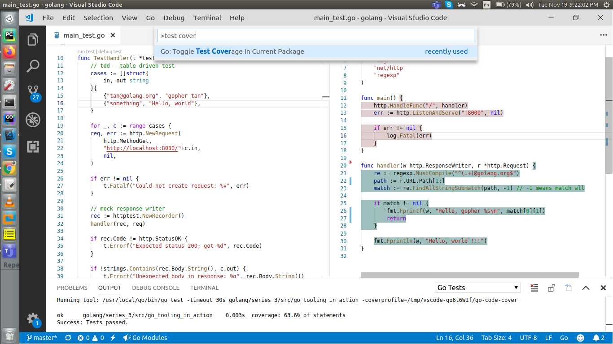
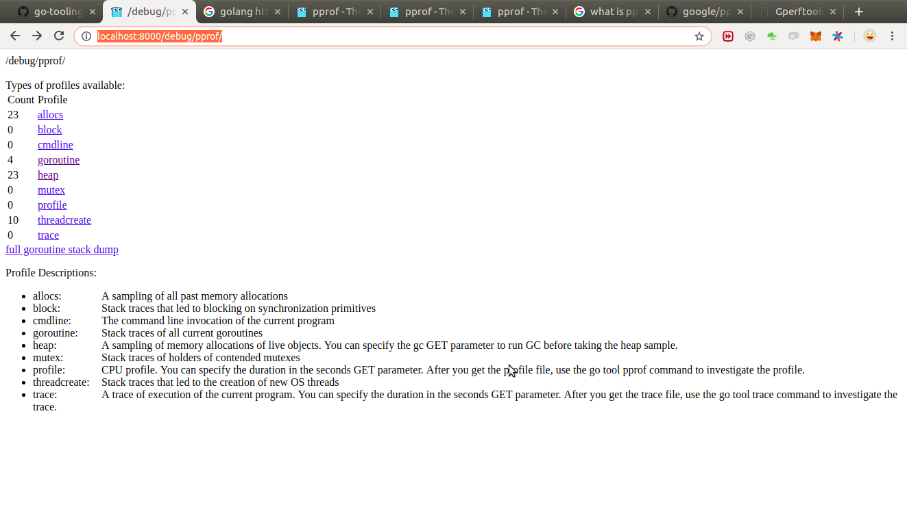

**Go Tooling in Action**

1. Go code formatting:

```bash
$ cat <<EOF >main.go
> package main
> import "fmt"
> func main(){fmt.Println("Hello, there.")}
> EOF
``` 

 Look `gotmft --help`
 ```bash
$ gofmt --help
usage: gofmt [flags] [path ...]
  -cpuprofile string
    	write cpu profile to this file
  -d	display diffs instead of rewriting files
  -e	report all errors (not just the first 10 on different lines)
  -l	list files whose formatting differs from gofmt's
  -r string
    	rewrite rule (e.g., 'a[b:len(a)] -> a[b:]')
  -s	simplify code
  -w	write result to (source) file instead of stdout
```

Println the formatted version of go code on terminal(stdout):
```bash
$ gofmt main.go 
package main

import "fmt"

func main() { fmt.Println("Hello, there.") }
```

Show the difference
```bash
$ gofmt -d main.go
diff -u main.go.orig main.go
--- main.go.orig	2019-11-15 16:17:26.736988097 +0530
+++ main.go	2019-11-15 16:17:26.736988097 +0530
@@ -1,3 +1,5 @@
 package main
+
 import "fmt"
-func main(){fmt.Println("Hello, there.")}
\ No newline at end of file
+
+func main() { fmt.Println("Hello, there.") }
```

Simplify and apply the formatting to `main.go`. You can run this on whole dir by doing `gofmt -s -w .`

```bash
$ gofmt -s -w main.go

$ cat main.go 
package main

import "fmt"

func main() { fmt.Println("Hello, there.") }
```

2. Cross compiling using `GOOS`
```bash
$ GOOS=windows go build

$ ll
total 2076
drwxrwxr-x 2 tan tan    4096 Nov 15 16:26 ./
drwxrwxr-x 4 tan tan    4096 Nov 15 15:54 ../
-rwxrwxr-x 1 tan tan 2106880 Nov 15 16:26 go_tooling_in_action.exe*
-rw-rw-r-- 1 tan tan      73 Nov 15 16:20 main.go
-rw-rw-r-- 1 tan tan    1381 Nov 15 16:26 README.md


$ file go_tooling_in_action.exe 
go_tooling_in_action.exe: PE32+ executable (console) x86-64 (stripped to external PDB), for MS Windows
```

3. `go install` - It will build the binary and move it to `GOPATH/din`.
```bash
go_tooling_in_action$ go install

go_tooling_in_action$ $GOPATH/bin/go_tooling_in_action 
Hello, there.
```

4. `go get` - Downloads, compiles and installs the binary.

```bash
go_tooling_in_action$ go get github.com/golang/example/hello
go: finding github.com/golang/example latest
go: downloading github.com/golang/example v0.0.0-20170904185048-46695d81d1fa
go: extracting github.com/golang/example v0.0.0-20170904185048-46695d81d1fa


go_tooling_in_action$ $GOPATH/bin/hello 
Hello, Go examples!
```

5. `go doc and list` - extracting info from Go packages

Show import path of the current pkg
```bash
go_tooling_in_action$ go list
golang/series_3/src/go_tooling_in_action

```

Show package name
```bash
go_tooling_in_action$ go list -f '{{ .Name }}'
main
```

Show package name and pkg level doc: `go doc` will also show you the pkg level doc
```bash
go_tooling_in_action$ go list -f '{{ .Name }}: {{ .Doc }}'
main: package related documentation which you can see on `$ go list -f '{{ .Doc }}'`
```

Show other pkg doc:
```bash
go_tooling_in_action$ go list -f '{{ .Doc }}' fmt
Package fmt implements formatted I/O with functions analogous to C's printf and scanf.

OR

go_tooling_in_action$ go doc fmt
package fmt // import "fmt"

Package fmt implements formatted I/O with functions analogous to C's printf
and scanf. The format 'verbs' are derived from C's but are simpler.

...
```

Get doc of specific func of a pkg:
```bash
go_tooling_in_action$ go doc fmt Println
package fmt // import "fmt"

func Println(a ...interface{}) (n int, err error)
    Println formats using the default formats for its operands and writes to
    standard output. Spaces are always added between operands and a newline is
    appended. It returns the number of bytes written and any write error
    encountered.
```

Get complete doc on http local server:
```bash
go_tooling_in_action$ go get -v  golang.org/x/tools/cmd/godoc
go_tooling_in_action$ godoc -http :8000

# now visit :- http://localhost:8000/
```

List all imports within this `main` pkg:

```bash
$ go list -f '{{ .Imports }}'
[fmt]
```

List all packages on which `fmt` package depends on:
```bash
go_tooling_in_action$ go list -f '{{ join .Imports "\n" }}' fmt
errors
internal/fmtsort
io
math
os
reflect
strconv
sync
unicode/utf8
```

-----

Running http server:
```go
package main

import (
	"fmt"
	"net/http"
)

func main() {
	http.HandleFunc("/", handler)
	http.ListenAndServe(":8000", nil)
}


func handler(w http.ResponseWriter, r *http.Request) {
	fmt.Println(w, "Hello, world !!!")
}

```            
Here when we run it, the is not running but not throwing any exceptions too, because go doesn't throws exception instead we have to explicitly get the error and handle it.
```bash
go_tooling_in_action$ go run main.go
```

But how to know at which line caused the error, so that we can get it and handle it explicitly.

For that we can use tool [`errcheck`](https://github.com/kisielk/errcheck):
```bash
go_tooling_in_action$ go get -u github.com/kisielk/errcheck
go: finding github.com/kisielk/errcheck v1.2.0
go: downloading github.com/kisielk/errcheck v1.2.0
go: extracting github.com/kisielk/errcheck v1.2.0
go: finding golang.org/x/tools latest

```

After running it, it shows the error occurred at last execution:
```bash
go_tooling_in_action$ errcheck 
main.go:11:21:	http.ListenAndServe(":8000", nil)
```
So we can see that we need to handle error at line no. `11`

```go
	err := http.ListenAndServe(":8000", nil)

	if err != nil {
		log.Fatal(err)
	}
```

And it works fine.

Now try go build again (will show no error):

```bash
go_tooling_in_action$ go build
```

Try `go vet` now:
```bash
go_tooling_in_action$ go vet
# golang/series_3/src/go_tooling_in_action
./main.go:27:3: Fprintln call has possible formatting directive %s
```

`go vet`: Vet examines Go source code and reports suspicious constructs. (`go doc cmd/vet`)

Now when we're hitting this url `http://localhost:8000/tan@golang.org` we're receiving panic error:

```bash
2019/11/19 10:37:40 http: panic serving [::1]:58216: runtime error: index out of range [1] with length 1

go_tooling_in_action$ errcheck 
main.go:27:14:	fmt.Fprintf(w, "Hello, gopher %s\n", match[1])
main.go:31:14:	fmt.Fprintln(w, "Hello, world !!!")
```

So let's try debugging the code.

**Debugging Go**

Will use `https://github.com/go-delve/delve` pkg for debugging.

```bash
go_tooling_in_action$ go get -u github.com/go-delve/delve/cmd/dlv

go_tooling_in_action$ dlv -l http://localhost:8000 debug .

(dlv) p path
"tan@golang.org"
(dlv) n
> main.handler() ./main.go:28 (PC: 0x781773)
    23:		runtime.Breakpoint()
    24:		re := regexp.MustCompile("^(.+)@golang.org$")
    25:		path := r.URL.Path[1:]
    26:		match := re.FindAllStringSubmatch(path, -1) // -1 means match all
    27:	
=>  28:		if match != nil {
    29:			fmt.Fprintf(w, "Hello, gopher %s\n", match[1])
    30:			return
    31:		}
    32:	
    33:		fmt.Fprintln(w, "Hello, world !!!")
(dlv) p match
[][]string len: 1, cap: 10, [
	[
		"tan@golang.org",
		"tan",
	],
]

```

- `p <object>` here `p` stands for print.

So we fixed the panic error with `match[0][1]`.


-----

**Unit Testing**

`<name>_test.go` - files ending with `_test.go` are ignored by the `go build|install|get` etc and will only run on `go test`.

Create `main_test.go` and run `go test`.
```bash
go_tooling_in_action$ go test
PASS
ok  	golang/series_3/src/go_tooling_in_action	0.003s
```

**Code Coverage**

Press `ctrl+shift+p` then type `test coverage`



-----
**Perf Profiles**

- Load testing with `go-wrk`
- Profiling with `pprof` - (`net/http/pprof`)
- Tool used - `https://github.com/adjust/go-wrk`

```bash
go_tooling_in_action$ go get -u github.com/adjust/go-wrk

go_tooling_in_action$ go-wrk -d 10 -c 10 -n 100000 -t 1000 http://localhost:8000/tan@golang.org
==========================BENCHMARK==========================
URL:				http://localhost:8000/tan@golang.org

Used Connections:		10
Used Threads:			1000
Total number of calls:		100000

===========================TIMINGS===========================
Total time passed:		29.68s
Avg time per request:		2.93ms
Requests per second:		3369.57
Median time per request:	2.15ms
99th percentile time:		14.19ms
Slowest time for request:	67.00ms

=============================DATA=============================
Total response body sizes:		1800000
Avg response body per request:		18.00 Byte
Transfer rate per second:		60652.27 Byte/s (0.06 MByte/s)
==========================RESPONSES==========================
20X Responses:		100000	(100.00%)
30X Responses:		0	(0.00%)
40X Responses:		0	(0.00%)
50X Responses:		0	(0.00%)
Errors:			0	(0.00%)
```

Importing `pprof` (`_ "net/http/pprof"`) - `https://golang.org/pkg/net/http/pprof/`

- `pprof` is a tool for visualization and analysis of profiling data.



**Let's try go tool with pprof**

1st terminal:
```bash
go_tooling_in_action$ go run main.go 
Serving at http://localhost:8000 ...
```

2nd terminal:
```bash
go_tooling_in_action$ go-wrk -n 1000000 http://localhost:8000/tan@golang.org
```

3rd terminal:
```bash
go_tooling_in_action$ go tool pprof --seconds=10 localhost:8000/debug/pprof/profile
Fetching profile over HTTP from http://localhost:8000/debug/pprof/profile?seconds=10
Please wait... (10s)
Saved profile in /home/tan/pprof/pprof.main.samples.cpu.004.pb.gz
File: main
Type: cpu
Time: Nov 20, 2019 at 7:44am (IST)
Duration: 10.11s, Total samples = 9.44s (93.35%)
Entering interactive mode (type "help" for commands, "o" for options)
(pprof) top
Showing nodes accounting for 4790ms, 50.74% of 9440ms total
Dropped 276 nodes (cum <= 47.20ms)
Showing top 10 nodes out of 203
      flat  flat%   sum%        cum   cum%
    1860ms 19.70% 19.70%     1920ms 20.34%  syscall.Syscall
     690ms  7.31% 27.01%      690ms  7.31%  runtime.futex
     500ms  5.30% 32.31%      580ms  6.14%  syscall.Syscall6
     420ms  4.45% 36.76%      420ms  4.45%  runtime.usleep
     400ms  4.24% 41.00%      400ms  4.24%  runtime.epollwait
     210ms  2.22% 43.22%     1630ms 17.27%  runtime.mallocgc
     200ms  2.12% 45.34%      200ms  2.12%  runtime.epollctl
     200ms  2.12% 47.46%      840ms  8.90%  runtime.heapBitsSetType
     160ms  1.69% 49.15%      190ms  2.01%  runtime.step
     150ms  1.59% 50.74%      340ms  3.60%  runtime.pcvalue
(pprof) web
(pprof)
```

`web` opens a svg file in browser:

